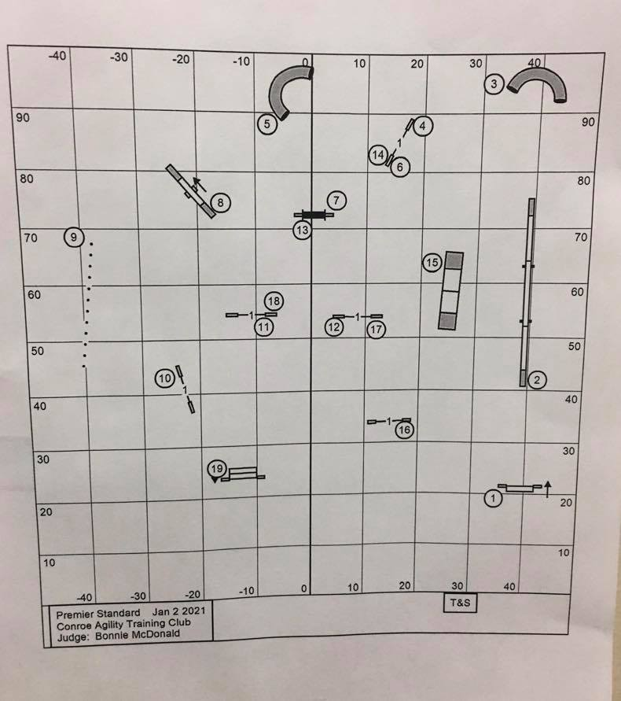

$\;$
$\;$
$\;$
$\;$

## NOTES

Your assignment must be submitted by the due date listed at the top of this document, and it must be submitted electronically in .pdf format via Crowdmark. This means that your responses for different questions should begin on separate pages of your .pdf file. Note that your .pdf solution file must have been generated by R Markdown. Additionally:

* For mathematical questions: your solutions must be produced by LaTeX (from within R Markdown). Neither screenshots nor scanned/photographed handwritten solutions will be accepted -- these will receive zero points.

* For computational questions: R code should always be included in your solution (via code chunks in R Markdown). If code is required and you provide none, you will receive zero points.

* For interpretation questions: plain text (within R Markdown) is required. Text responses embedded as comments within code chunks will not be accepted.

Organization and comprehensibility is part of a full solution. Consequently, points will be deducted for solutions that are not organized and incomprehensible. Furthermore, if you submit your assignment to Crowdmark, but you do so incorrectly in any way (e.g., you upload your Question 2 solution in the Question 1 box), you will receive a 5% deduction (i.e., 5% of the assignment’s point total will be deducted from your point total).

\newpage

## QUESTION 1 (18 marks): Dog Agility Part 1 - User-defined functions

This is part 1 of a project that will span 3 or 4 assignments in which the end goal is to analyze maps of dog agility courses and assess them for things like overall difficulty. In this first part, we're just going to be establishing the functions necessary to determine the physical dynamics of an arbitrary path.





A lot of what we're going to do in Stat 341 involves user-defined functions, so it's good to get used to making and using them here.


The paths we'll be using are generated from the following:

- A cubic Bezier curve (`bezier_path_x` and `bezier_path_y`)
- A spaceship leaving one body and landing on another. (`space_path`)
- A heart (`heart_path`)

```{r}
px = c(0,3,7,10)
py = c(0,5,5,2)
t = seq(from=0, to=1, by=0.01)
bezier_path_x = (1-t)^3*px[1] + 
                3*(1-t)^2*t*px[2] +  
                3*(1-t)*t^2*px[3] +  
                t^3*px[4]
bezier_path_y = (1-t)^3*py[1] + 
                3*(1-t)^2*t*py[2] +  
                3*(1-t)*t^2*py[3] +  
                t^3*py[4]


t = seq(from=0, to=2*pi, length=101)
space_path_x = c((t + 4)*sin(3*t), 
                 seq(from=0, to=30, length=40), 
                 rev(30 - (t + 1)*sin(3*t)))
space_path_y = c((t + 4)*cos(3*t) , 
                 seq(from=10.283, to=19.283, length=40),
                 rev(12 + (t + 1)*cos(3*t)))


t = seq(from=0, to=2*pi, length=101)
heart_path_x = 16*sin(t)^3
heart_path_y = 13*cos(t) - 5*cos(2*t) - 2*cos(3*t) - cos(4*t)


par(mfrow = c(1,3))
plot(bezier_path_x, bezier_path_y, type="b", main="Cubic Bezier path")
plot(space_path_x, space_path_y, type="b", main="Space orbital path")
plot(heart_path_x, heart_path_y, type="b", main="Heart path")
par(mfrow = c(1,1))

  
```


Here are an example function to get you started. This measures the mean velocity along a path of time snapshots in 2D space. (Alternatively, replacing mean)

```{r}
mean_velocity_2d = function(x,y)
{
  dx = diff(x) # or x[-1] - x[-n]
  dy = diff(y)
  v = sqrt(dx^2 + dy^2)
  m_v = mean(v)
  return(m_v)
}
```


Create and report functions for the following.

a) (1 mark) Total distance traveled.

b) (3 marks) Mean absolute change in direction, where direction can be measured as `atan2(dy, dx)` or `atan(dy/dx)`.

c) (4 marks) Maximum absolute curvature, where curvature $\kappa$ is 

$$\kappa = \frac{\det(P', P'')}{||P'||^3} = \frac{dx d^2y - dy d^2x}{((dx)^2 + (dy)^2)^{3/2}}$$
d) (6 marks) The 80th percentile of acceleration. The `quantile()` function may be useful in checking your work, but your solution should not include `quantile()`. Instead try, something with `sort()`, `length()`, and `round()`.

e) Test you functions on the paths `bezier_path`, `space_path`, and `heart_path`, and fill in the following markdown table to four significant figures. (4 marks)

```{r}
mean_velocity_2d(bezier_path_x, bezier_path_y)
mean_velocity_2d(space_path_x, space_path_y)
mean_velocity_2d(heart_path_x, heart_path_y)

```

|    Function   | Bezier | Space | Heart |
|----------------------------|--------|-------|-------|
| Mean Velocity              | 0.1221 | 1.013 | 1.021 |
| Total Distance             |        |       |       |
| Mean Abs. Direction Change |        |       |       |
| Max. Abs. Curve            |        |       |       |
| 80th %ile of Acceleration  |        |       |       |


Sources:  

Agility & Beyond - Course Map Archives https://www.agilityandbeyond.com/course-map-archive/

Acegikmo - The Beauty of Bezier Curves, https://www.youtube.com/watch?v=aVwxzDHniEw


\newpage

# QUESTION 2 (12 marks): Rural vs. Urban Ontario Part 1 - Power Transforms

Like question 1, this is part 1 of a project that will span 3 or 4 assignments. Here the end goal is become familiar with the data structures that Statistics Canada uses, and learn how we can use these to answer demographic and business questions for both the private and public sectors.


a) (0 marks) Use the following code to find all the census subdivisions (CSDs) in Ontario that are .

```{r}
library(cancensus) # You will need to install.packages("cancensus") one time before this package will load.

all_regions = list_census_regions("CA21") # 2021 census
rural_on_regions = subset(all_regions, 
                          level=="CSD" &  # census subdivisions
                            PR_UID == 35 & # in Ontario
                            is.na(CMA_UID)) # not inside a metropolitan area

csd_list = list(CSD = rural_on_regions$region)

census_data = get_census(dataset = "CA21",
                         regions = csd_list, 
                         level = "CSD")

names(census_data)[4] = "Area"
head(census_data)
```


b) (2 marks) Find the Pearson (default) correlation between the area and the population in rural areas.

c) (4 marks) Plot the scatterplot between population (y) over area (x) of rural CSDs and use what you see to make an argument as to what kinds of power transformations on x and y are likely to increase the correlation coefficient.


d) (6 marks) Try all combinations of the following power transformations on area and population on rural areas, and find the best correlation coefficient amongst transformed datasets.

Show your code and report what combination gives the strongest correlation and what that correlation is.

The power transformations are `log(x)`, `sqrt(x)`, `-1/x`, `x^2`, and `x^3`.

\newpage

# QUESTION 3 (10 marks): Reading assignment - Quantum computing applied to Stock Portfolios


Read pages 1-15 of the article "Portfolio Optimization of 60 Stocks Using Classical and Quantum Algorithms" by the group Chicago Quantum and use it to answer the following questions. The article is found in Learn in the same folder as this assignment.


Unless a question says "in your own words", you may take quotes directly from the article without citation.

For your interest, QUBO stands for Quadratic unconstrained binary optimization, even though it is never explicitly stated in the article. You shouldn't need this information to answer the questions, but the term comes up enough that you should know.


Questions:

a) (2 marks) In your own words. Assuming that the Chicago Quantum Ratio (CQR) is meant to be maximized, what two features of the ideal stock portfolio does this imply?


b) (1 mark) What is the size of the population of candiate 60-asset portfolios?


c) (2 marks) In your own words (30 words or fewer), how does the genetic algorithm being applied to stocks work in this instance. Not every detail is needed.

d) (1 mark) Does a hotter 'temperature' in a simulated annealer imply that the solution is more or less likely to settle into a local minima? No explanation is necessary.

e) (1 mark) Is Chicago Quantum Net Score being minimized or maximized by the D-Wave system in this application? No explanation is necessary.

f) (1 mark) What tendency did the D-Wave system have when finding portfolios that differed from what was desired? No explanation is necessary.

g) (2 marks) In your own word, in comparative analysis, how well did the D-Wave system do at finding the best possible portfolio?